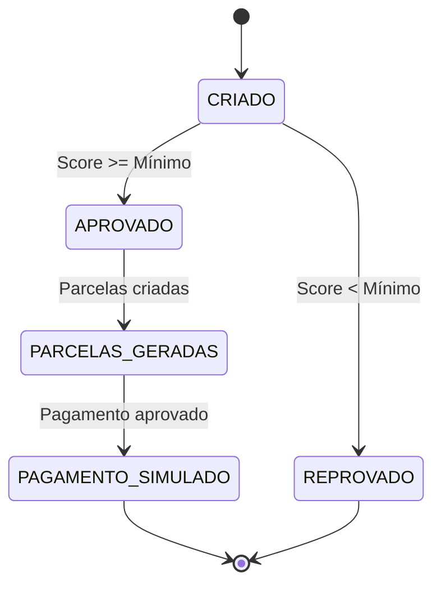
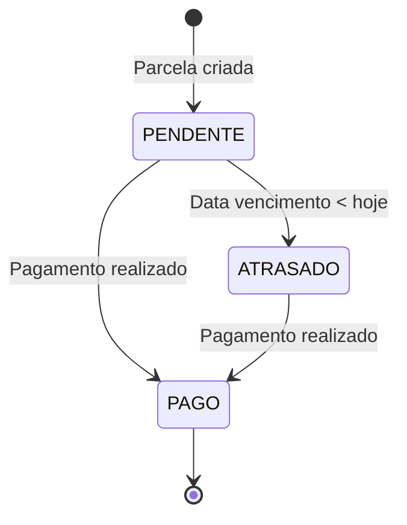

# 📋 Regras de Negócio - CrediFit

## 📋 Índice

- [Visão Geral](#visão-geral)
- [Domínio de Empresas](#domínio-de-empresas)
- [Domínio de Funcionários](#domínio-de-funcionários)
- [Domínio de Empréstimos](#domínio-de-empréstimos)
- [Validações e Regras](#validações-e-regras)
- [Fluxos de Negócio](#fluxos-de-negócio)
- [Cálculos e Fórmulas](#cálculos-e-fórmulas)
- [Estados e Transições](#estados-e-transições)

## 🎯 Visão Geral

O CrediFit implementa um sistema de empréstimos para funcionários com regras de negócio específicas para garantir segurança, conformidade e viabilidade financeira.

### Princípios Fundamentais

1. **Segurança**: Validação rigorosa de dados e documentos
2. **Transparência**: Regras claras e comunicadas ao usuário
3. **Responsabilidade**: Limites baseados na capacidade de pagamento
4. **Automatização**: Processo digital e sem intervenção manual

## 🏢 Domínio de Empresas

### Regras de Cadastro

#### CNPJ (Cadastro Nacional da Pessoa Jurídica)

- **Formato**: Aceita com ou sem formatação
- **Validação**: Algoritmo oficial de validação
- **Unicidade**: CNPJ deve ser único no sistema
- **Exemplo válido**: `11.222.333/0001-81`

#### Representante Legal

- **CPF**: Deve ser válido e único no sistema
- **Nome**: Obrigatório, mínimo 2 caracteres
- **Email**: Formato válido, único no sistema
- **Responsabilidade**: Representante legal da empresa

#### Dados da Empresa

- **Razão Social**: Obrigatória, nome oficial da empresa
- **Status**: Ativa por padrão
- **Relacionamentos**: Uma empresa pode ter múltiplos funcionários

### Validações Específicas

```typescript
// Exemplo de validação de CNPJ
export function isValidCNPJ(cnpj: string): boolean {
  // 1. Remove formatação
  const cleanCNPJ = normalizeCNPJ(cnpj);

  // 2. Verifica se tem 14 dígitos
  if (cleanCNPJ.length !== 14) return false;

  // 3. Verifica se não são todos iguais
  if (/^(\d)\1{13}$/.test(cleanCNPJ)) return false;

  // 4. Valida dígitos verificadores
  // ... algoritmo de validação
}
```

## 👥 Domínio de Funcionários

### Regras de Cadastro

#### Dados Pessoais

- **Nome**: Obrigatório, mínimo 2 caracteres
- **CPF**: Válido e único no sistema
- **Email**: Válido e único no sistema
- **Senha**: Mínimo 6 caracteres

#### Dados Profissionais

- **Salário**: Obrigatório, maior que zero
- **Empresa**: Deve existir e estar ativa
- **Status**: Ativo por padrão

#### Relacionamentos

- **Empresa**: Funcionário pertence a uma empresa
- **Empréstimos**: Funcionário pode ter múltiplos empréstimos
- **Histórico**: Mantém histórico de transações

### Validações Específicas

```typescript
// Exemplo de validação de CPF
export function isValidCPF(cpf: string): boolean {
  // 1. Remove formatação
  const cleanCPF = normalizeCPF(cpf);

  // 2. Verifica se tem 11 dígitos
  if (cleanCPF.length !== 11) return false;

  // 3. Verifica se não são todos iguais
  if (/^(\d)\1{10}$/.test(cleanCPF)) return false;

  // 4. Valida dígitos verificadores
  // ... algoritmo de validação
}
```

## 💰 Domínio de Empréstimos

### Regras de Simulação

#### Margem de Crédito

- **Cálculo**: 35% do salário do funcionário
- **Fórmula**: `margemCredito = salario * 0.35`
- **Exemplo**: Salário R$ 3.500 → Margem R$ 1.225

#### Valor Solicitado

- **Limite**: Não pode exceder a margem de crédito
- **Mínimo**: R$ 100,00
- **Validação**: `valorSolicitado <= margemCredito`

#### Opções de Parcelamento

- **Quantidade**: 1 a 4 parcelas
- **Cálculo**: `valorParcela = valorSolicitado / quantidadeParcelas`
- **Exemplo**: R$ 1.000 em 3x = R$ 333,33 cada

### Regras de Aprovação

#### Score de Crédito

Baseado em faixas salariais:

| Faixa Salarial  | Score Mínimo |
| --------------- | ------------ |
| Até R$ 2.000    | 400          |
| Até R$ 4.000    | 500          |
| Até R$ 8.000    | 600          |
| Até R$ 12.000   | 700          |
| Acima R$ 12.000 | 700          |

#### Critérios de Aprovação

1. **Score**: Deve ser >= score mínimo da faixa salarial
2. **Margem**: Valor solicitado <= margem de crédito
3. **Histórico**: Sem empréstimos em atraso (futuro)
4. **Limite**: Máximo 1 empréstimo ativo por funcionário

### Regras de Parcelas

#### Geração Automática

- **Quantidade**: Baseada na solicitação
- **Valor**: Igual para todas as parcelas
- **Vencimento**: Mensal, a partir do próximo mês

#### Estrutura da Parcela

```typescript
interface Parcela {
  numeroParcela: number; // 1, 2, 3, 4
  valor: number; // valorSolicitado / quantidadeParcelas
  dataVencimento: Date; // Próximo mês + número da parcela
  status: 'PENDENTE' | 'PAGO' | 'ATRASADO';
}
```

### Estados do Empréstimo

```typescript
enum STATUS_EMPRESTIMO {
  APROVADO = 'APROVADO',
  REPROVADO = 'REJEITADO',
}
```

## 🔍 Validações e Regras

### Validações de Entrada

#### Email

- **Formato**: `usuario@dominio.com`
- **Domínio**: Deve ter TLD válido
- **Comprimento**: Máximo 254 caracteres
- **Regex**: `/^[a-zA-Z0-9._-]+@[a-zA-Z0-9.-]+\.[a-zA-Z]{2,6}$/`

#### Documentos

- **CPF**: 11 dígitos, algoritmo oficial
- **CNPJ**: 14 dígitos, algoritmo oficial
- **Normalização**: Remove formatação automaticamente

#### Valores Monetários

- **Tipo**: Number (float)
- **Precisão**: 2 casas decimais
- **Mínimo**: 0.01
- **Máximo**: Margem de crédito

### Regras de Negócio

#### Unicidade

- **CPF**: Único por funcionário
- **CNPJ**: Único por empresa
- **Email**: Único por usuário (funcionário/empresa)

#### Integridade Referencial

- **Funcionário**: Deve pertencer a empresa válida
- **Empréstimo**: Deve pertencer a funcionário válido
- **Parcela**: Deve pertencer a empréstimo válido

#### Consistência de Dados

- **Salário**: Não pode ser negativo
- **Valor Empréstimo**: Não pode exceder margem
- **Quantidade Parcelas**: Entre 1 e 4

## 🔄 Fluxos de Negócio

### Fluxo de Cadastro de Empresa

```
1. Receber dados da empresa
   ↓
2. Validar CNPJ (formato + algoritmo)
   ↓
3. Verificar unicidade do CNPJ
   ↓
4. Validar CPF do representante
   ↓
5. Verificar unicidade do CPF
   ↓
6. Validar email do representante
   ↓
7. Verificar unicidade do email
   ↓
8. Criar empresa no banco
   ↓
9. Retornar empresa criada
```

### Fluxo de Cadastro de Funcionário

```
1. Receber dados do funcionário
   ↓
2. Validar CPF (formato + algoritmo)
   ↓
3. Verificar unicidade do CPF
   ↓
4. Validar email
   ↓
5. Verificar unicidade do email
   ↓
6. Verificar se empresa existe
   ↓
7. Hash da senha
   ↓
8. Criar funcionário no banco
   ↓
9. Gerar token JWT
   ↓
10. Retornar token
```

### Fluxo de Simulação de Empréstimo

```
1. Receber valor solicitado
   ↓
2. Buscar dados do funcionário
   ↓
3. Calcular margem de crédito (35% do salário)
   ↓
4. Validar se valor <= margem
   ↓
5. Gerar opções de parcelamento (1-4x)
   ↓
6. Retornar simulação
```

### Fluxo de Criação de Empréstimo

```
1. Receber dados do empréstimo
   ↓
2. Validar funcionário
   ↓
3. Calcular margem de crédito
   ↓
4. Validar valor solicitado
   ↓
5. Consultar score de crédito (API externa)
   ↓
6. Validar score mínimo
   ↓
7. Determinar status (APROVADO/REPROVADO)
   ↓
8. Criar empréstimo no banco
   ↓
9. Se aprovado:
    - Gerar parcelas
    - Simular pagamento (API externa)
   ↓
10. Retornar empréstimo criado
```

## 🧮 Cálculos e Fórmulas

### Margem de Crédito

```typescript
function calcularMargemCredito(salario: number): number {
  return salario * 0.35; // 35% do salário
}
```

### Valor da Parcela

```typescript
function calcularValorParcela(
  valorSolicitado: number,
  quantidadeParcelas: number,
): number {
  return valorSolicitado / quantidadeParcelas;
}
```

### Score Mínimo por Faixa Salarial

```typescript
function obterScoreMinimo(salario: number): number {
  if (salario <= 2000) return 400;
  if (salario <= 4000) return 500;
  if (salario <= 8000) return 600;
  if (salario <= 12000) return 700;
  return 700; // Acima de R$ 12.000
}
```

### Data de Vencimento da Parcela

```typescript
function calcularDataVencimento(numeroParcela: number): Date {
  const dataAtual = new Date();
  const dataVencimento = new Date(dataAtual);
  dataVencimento.setMonth(dataVencimento.getMonth() + numeroParcela);
  return dataVencimento;
}
```

## 📊 Estados e Transições

### Estados do Empréstimo



### Estados da Parcela



### Regras de Transição

#### Empréstimo

- **CRIADO → APROVADO**: Score >= mínimo da faixa salarial
- **CRIADO → REPROVADO**: Score < mínimo da faixa salarial
- **APROVADO → PARCELAS_GERADAS**: Parcelas criadas automaticamente
- **PARCELAS_GERADAS → PAGAMENTO_SIMULADO**: Simulação de pagamento aprovada

#### Parcela

- **PENDENTE → PAGO**: Pagamento realizado
- **PENDENTE → ATRASADO**: Data de vencimento ultrapassada
- **ATRASADO → PAGO**: Pagamento realizado (mesmo atrasado)

## 🔒 Regras de Segurança

### Autenticação

- **JWT**: Token com expiração
- **Rate Limiting**: Proteção contra força bruta
- **Validação**: Todos os dados de entrada validados

### Autorização

- **Funcionário**: Acesso apenas aos próprios dados
- **Empresa**: Acesso apenas aos próprios funcionários
- **Empréstimos**: Acesso apenas aos próprios empréstimos

### Auditoria

- **Logs**: Todas as operações logadas
- **Rastreabilidade**: IDs únicos para todas as entidades
- **Timestamps**: Data/hora de criação e modificação

## 📈 Métricas e Limites

### Limites do Sistema

- **Margem de Crédito**: 35% do salário
- **Parcelas**: 1 a 4 vezes
- **Score Mínimo**: 400 a 700 (por faixa salarial)
- **Rate Limiting**: 100 requests/15min (geral), 10 requests/5min (auth)

### Métricas de Negócio

- **Taxa de Aprovação**: Baseada em score
- **Valor Médio**: Estatísticas por empresa
- **Inadimplência**: Controle de parcelas em atraso
- **Performance**: Tempo de resposta das APIs

---
